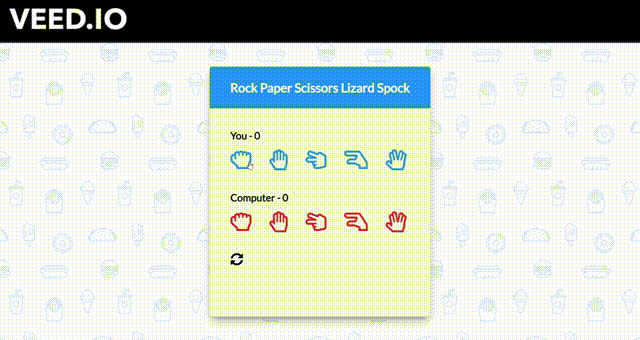
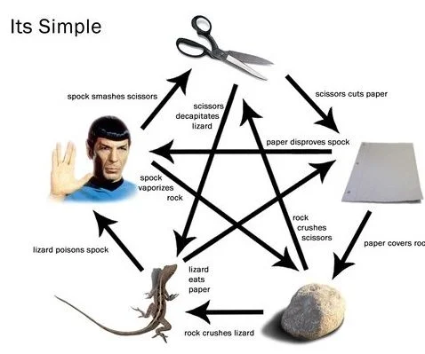
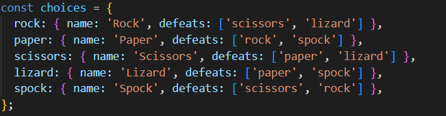
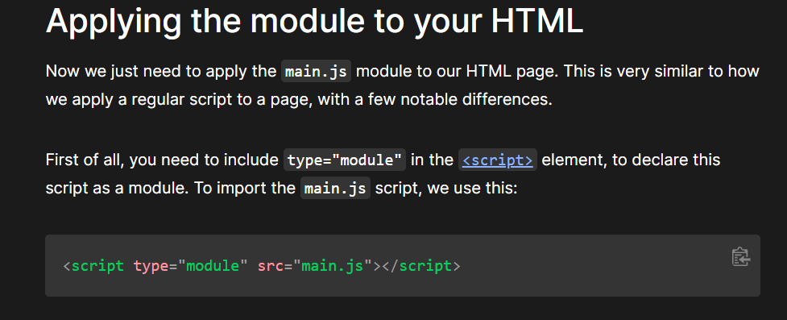
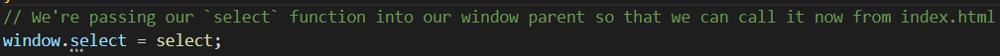

<!-- Improved compatibility of back to top link: See: https://github.com/othneildrew/Best-README-Template/pull/73 -->

<!--
*** Thanks for checking out the Best-README-Template. If you have a suggestion
*** that would make this better, please fork the repo and create a pull request
*** or simply open an issue with the tag "enhancement".
*** Don't forget to give the project a star!
*** Thanks again! Now go create something AMAZING! :D
-->

<!-- PROJECT SHIELDS -->
<!--
*** I'm using markdown "reference style" links for readability.
*** Reference links are enclosed in brackets [ ] instead of parentheses ( ).
*** See the bottom of this document for the declaration of the reference variables
*** for contributors-url, forks-url, etc. This is an optional, concise syntax you may use.
*** https://www.markdownguide.org/basic-syntax/#reference-style-links
-->
[![Contributors][contributors-shield]][contributors-url]
[![Forks][forks-shield]][forks-url]
[![Stargazers][stars-shield]][stars-url]
[![Issues][issues-shield]][issues-url]
[![MIT License][license-shield]][license-url]
[![LinkedIn][linkedin-shield]][linkedin-url]

<!-- PROJECT LOGO -->
 

  

<h3 align="center">Spock Rock Game</h3>

  

    A JavaScript based Spock Rock Game feat. Confetti.js, Modules
     
    <a href="https://github.com/Prasenjit-3433/Spock-Rock-Game"><strong>Explore the docs »</strong></a>
     
     
    <a href="https://spockrockjsgame.netlify.app/">View Demo</a>
    ·
    <a href="https://github.com/Prasenjit-3433/Spock-Rock-Game/issues">Report Bug</a>
    ·
    <a href="https://github.com/Prasenjit-3433/Spock-Rock-Game/issues">Request Feature</a>
  

<!-- TABLE OF CONTENTS -->

  
Table of Contents

  <ol>
    <li>
      <a href="#about-the-project">About The Project</a>
      <ul>
        <li><a href="#built-with">Tech Stack</a></li>
      </ul>
    </li>
    <li>
      <a href="#getting-started">Getting Started</a>
      <ul>
        <li><a href="#prerequisites">Prerequisites</a></li>
        <li><a href="#installation">Installation</a></li>
      </ul>
    </li>
    <li><a href="#implementation">Implementation</a></li>
    <li><a href="#contributing">Contributing</a></li>
    <li><a href="#license">License</a></li>
    <li><a href="#contact">Contact</a></li>
    <li><a href="#acknowledgments">Acknowledgments</a></li>
  </ol>

<!-- ABOUT THE PROJECT -->
## 🙋 About The Project

 

Rock Paper Scissors Lizard Spock is an extension of the classic game of chance, Rock Paper Scissors, created by Sam Kass and Karen Bryla. Sam Kass explains he created the expanded game because it seemed like most games of Rock Paper Scissors with people you know would end in a tie. Rock Paper Scissors Lizard Spock was first mentioned in the Season 2 episode, The Lizard-Spock Expansion, the title of which references the game.

There is also a Confetti falling animation across the screen over the win. Just play & enjoy! :smile:

(<a href="#readme-top">back to top</a>)

### 🛠 Built With

* 
* 
* 
* 

(<a href="#readme-top">back to top</a>)

<!-- GETTING STARTED -->
## 🚀 Getting Started

This is an example of how you may start on setting up your project locally.
To get a local copy up and running follow these simple example steps.

### Prerequisites

This is an example of how to list things you need to use the software and how to install them.
* Live Server Extension
  

### Installation

1. First of all install `Live Server` extension by `Ritwick Dey`.
2. Once the extension was installed, then `right-click` on `index.html` and select `Open with Live Server`.
3. It'll open a new tab in browser & start serving the game. Enjoy!.

(<a href="#readme-top">back to top</a>)

<!-- USAGE EXAMPLES -->
## 🏗️ Implementation

* First of all, we need to gather all `functional requirements` of the game like:
*  

    
Functional Requirements:

    <ol>
      <li>Two players play the game by each picking a symbol randomly: the selected symbols determine who the winner is.</li>
      <li>
        
The allowed moves are Paper, Rock, Scissors, Lizard, Spock and they interact as follows:        
           “Scissors cuts paper, paper covers rock, rock crushes lizard, lizard poisons Spock, Spock smashes scissors, scissors decapitates lizard, lizard eats paper, paper disproves Spock, Spock vaporizes rock, rock crushes scissors.”

      </li>
      <li>If both players pick the same symbol, your application will not select a winner and declare the game a tie</li>
    </ol>
  

 

* Then break the whole game into small `Ui Components` & start building indivisual components.

Ui Components:

<ol>
<li>
    

      
Game Board

      <ul>
        <li>The whole game'll be inside of a Game-Board which receives certain width on different viewports.</li>
        <li>There'll be two players: User & Computer.</li>
        <li>The icons are outsourced from FontAwesome's regular icon collection & Each icon represents a player's move </li>
        <li>The player container divided into two sections - one for User & one for computer.</li>
        <li>Each section'll contain "player-name" followed by "score" and then "name-of-the-choice" the player selects. </li>
        <li>Next, all the "move-icons" sits in line.</li>
      </ul>
    

  </li>
  </li>
  <li>
    

      
Player's Move Icon

      <ul>
        <li>For user's selection, when user click on an icon, it's color turns into black & updates the "name-of-the-choice" portion from "choice" (by-default) to the selected one.</li>
        <li>For computer's choice, generate a number between 0 & 1 and divided whole (0, 1) interval into 5 parts - each of width 0.2. According as where does the generated number lie, we assign one from 'rock', 'paper', 'scissors', 'lizard', 'spock' respectively.</li>
        <li>Once computer chooses it's move, the respected icon's color on the game board turns into black & updates the "name-of-the-choice" portion from "choice" (by-default) to the selected one.</li>
        <li>Before allowing user to click again, the game board automatically reset previous choices of both player and computer.</li>
        <li>Here "Switch Statement" is used to implement such feature in both cases.</li>
      </ul>
    

    </li>
  <li>
    

      
Determining Winner

      <ul>
        <li>First of all, it's very crucial to choose a right data structure to hold choices:</li>
        <li></li>
        <li>Corresponding to the player's choice, if defeats array inside of that choice contains Computer's choice, then player wins. Otherwise Computer wins.</li>
        <li>Finally, update the score of both player & computer in the game board.</li>
      </ul>
    

  </li>
  <li>
  

      
Confetti falling animation over Win

    <ul>
        <li>Here we used confetti.js, a vanilla JS library for creating a configurable, high-performance confetti falling animation using HTML5 canvas and requestAnimFrame API.</li>
        <li>The confetti.js is modified little bit to bring the code under anonymous function into global scope. So that these three functions: 'startConfetti', 'stopConfetti', 'removeConfetti' become globally available.</li>
        <li>The good news is that modern browsers have started to support module functionality natively. This can only be a good thing — browsers can optimize loading of modules, making it more efficient than having to use a library and do all of that extra client-side processing and extra round trips.</li>
        <li>In order to do that, firstly we have to export the above three specified functions & import them inside main script file. Then execute main script file as the top-level module: </li>
        <li></li>
        <li>But type="module" makes main script self-contained. That means the main script no longer shares in global scope with the elements in index.html</li>
        <li>To make things globally available, pass it into Window object like this: </li>
        <li></li>
      </ul>
    

  </li>
</ol>

_To see in action, please visit to the [Link](https://spockrockjsgame.netlify.app/)_

(<a href="#readme-top">back to top</a>)

<!-- CONTRIBUTING -->
## 🤝 Contributing

Contributions are what make the open source community such an amazing place to learn, inspire, and create. Any contributions you make are **greatly appreciated**.

If you have a suggestion that would make this better, please fork the repo and create a pull request. You can also simply open an issue with the tag "enhancement".
Don't forget to give the project a star! Thanks again!

1. Fork the Project
2. Create your Feature Branch (`git checkout -b feature/AmazingFeature`)
3. Commit your Changes (`git commit -m 'Add some AmazingFeature'`)
4. Push to the Branch (`git push origin feature/AmazingFeature`)
5. Open a Pull Request

(<a href="#readme-top">back to top</a>)

<!-- LICENSE -->
## 📜 License

Distributed under the MIT License. See `LICENSE.txt` for more information.

(<a href="#readme-top">back to top</a>)

<!-- CONTACT -->
## 📮 Contact

Prasenjit Sutradhar - [@twitter_handle](https://twitter.com/twitter_handle) - prasenjitsutradhar3433@gmail.com

Project Link: [https://github.com/Prasenjit-3433/Spock-Rock-Game](https://github.com/Prasenjit-3433/Spock-Rock-Game)

(<a href="#readme-top">back to top</a>)

<!-- ACKNOWLEDGMENTS -->
## ✌️ Acknowledgments

* [Fontawesome](https://fontawesome.com/)
* [Confett.js](https://www.cssscript.com/confetti-falling-animation/)
* [Heropatterns - SVG Background](https://heropatterns.com/)

(<a href="#readme-top">back to top</a>)

<!-- MARKDOWN LINKS & IMAGES -->
<!-- https://www.markdownguide.org/basic-syntax/#reference-style-links -->
[contributors-shield]: https://img.shields.io/github/contributors/Prasenjit-3433/Spock-Rock-Game.svg?style=for-the-badge
[contributors-url]: https://github.com/Prasenjit-3433/Spock-Rock-Game/graphs/contributors
[forks-shield]: https://img.shields.io/github/forks/Prasenjit-3433/Spock-Rock-Game.svg?style=for-the-badge
[forks-url]: https://github.com/Prasenjit-3433/Spock-Rock-Game/network/members
[stars-shield]: https://img.shields.io/github/stars/Prasenjit-3433/Spock-Rock-Game.svg?style=for-the-badge
[stars-url]: https://github.com/Prasenjit-3433/Spock-Rock-Game/stargazers
[issues-shield]: https://img.shields.io/github/issues/Prasenjit-3433/Spock-Rock-Game.svg?style=for-the-badge
[issues-url]: https://github.com/Prasenjit-3433/Spock-Rock-Game/issues
[license-shield]: https://img.shields.io/github/license/Prasenjit-3433/Spock-Rock-Game.svg?style=for-the-badge
[license-url]: https://github.com/Prasenjit-3433/Spock-Rock-Game/blob/main/LICENSE.txt
[linkedin-shield]: https://img.shields.io/badge/-LinkedIn-black.svg?style=for-the-badge&logo=linkedin&colorB=555
[linkedin-url]: https://in.linkedin.com/
[product-screenshot]: images/screenshot.png
[HTML5]: https://img.shields.io/badge/HTML5-f06529?style=for-the-badge&logo=html5&logoColor=white
[HTML-url]: https://developer.mozilla.org/en-US/docs/Glossary/HTML5
[Css]: https://img.shields.io/badge/CSS3-2965f1?style=for-the-badge&logo=CSS3&logoColor=white
[Css-url]: https://developer.mozilla.org/en-US/docs/Web/CSS
[Js]: https://img.shields.io/badge/JavaScript-F0DB4F?style=for-the-badge&logo=JavaScript&logoColor=323330
[Js-url]: https://www.javascript.com/

